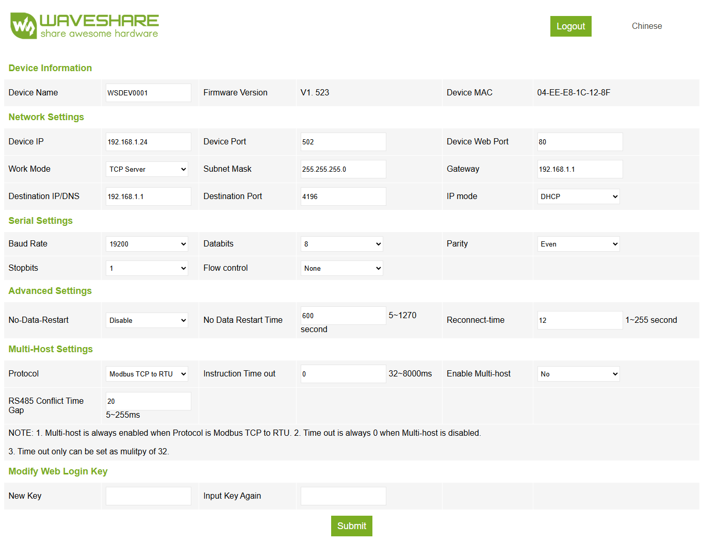

# Proxon Home Assistant Integration guide (WIP Version 0.1)
Full integration guide of Proxon heat pump into Home Assistant

Tested with:
- Proxon FWT2 (build 2017) and recent Proxon updates
- Waveshare RS485 to eth POE Adapter (https://www.waveshare.com/)

## Hardware Setup

Prerequisits: Modbus-TCP-Adapter (RS485 to Ethernet)

1. Wire Modbus port to Modbus-TCP-Adapter
2. Power your adapter by a power source or in my case, I simply used a POE-Switch
3. Connect Adapter to your local network

## Home Assistant Setup

1. Configure Modbus-TCP-Adapter
   
   For "Destination IP/DNS" you must enter your routers IP address. Remember your adapter's mac-address
2. In your router configure a static IP address for your adapter using its mac-address
   (if you router is not capable to reserve IPs for local devices you can try to use IP Mode "static" instead of "DHCP" but this can lead to issues
4. Configure Home Assistant
   You can use example snipped [modbus.yml](./modbus.yml) to extend your Home Assistant's "configuration.yml"
   Update the IP address to your local settings.
   Change/update/add example rooms to your actual settings.
